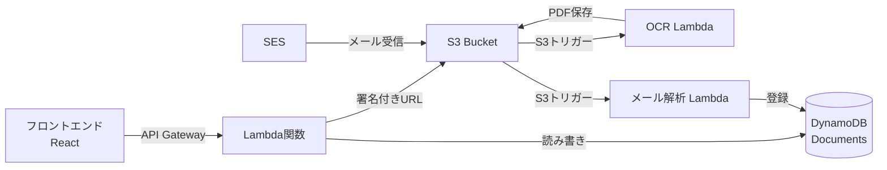

<div align="center">

# 📄 All-Vault-Cloud

**FAX・メール一元管理クラウドシステム**

[](https://aws.amazon.com/)
[](https://www.typescriptlang.org/)
[](https://reactjs.org/)

受信したFAXとメールを一元管理し、OCR処理・PDF変換・返信機能を提供するサーバーレスシステム

[🚀 デモを見る](#) | [📖 ドキュメント](#-api-エンドポイント) | [🐛 バグ報告](https://github.com/BlackBathRoom/All-Vault-Cloud/issues)

</div>

---

## ✨ 主な機能

<table>
<tr>
<td width="50%">

### 📨 FAX管理
- 画像アップロード（署名付きURL）
- 自動OCR処理
- PDF変換・保存
- 一覧表示・検索

</td>
<td width="50%">

### 📧 メール管理
- 受信メール自動取り込み
- 添付ファイル自動抽出
- 返信機能（SES連携）
- 本文・添付の一元管理

</td>
</tr>
</table>

---

## 🏗️ システムアーキテクチャ



---

## 🚀 クイックスタート

### 📋 前提条件

- Node.js 18以上
- AWS アカウント
- AWS CLI 設定済み

### 🎯 フロントエンド起動

```bash
# リポジトリをクローン
git clone https://github.com/BlackBathRoom/All-Vault-Cloud.git
cd All-Vault-Cloud/frontend

# 依存関係をインストール
npm install

# 開発サーバー起動
npm run dev
```

ブラウザで `http://localhost:3000` にアクセス 🎉

---

## 🌐 API エンドポイント

**ベースURL**: `https://24bdzijg8k.execute-api.ap-northeast-1.amazonaws.com`

### 📚 文書管理

<details open>
<summary><b>GET</b> <code>/documents</code> - 文書一覧取得</summary>

#### クエリパラメータ
| パラメータ | 型 | 説明 | 例 |
|-----------|-----|------|-----|
| `type` | string | 文書タイプ（省略可） | `fax`, `email_body`, `email_attachment` |

#### レスポンス例
```json
[
  {
    "id": "b7815804-8d5a-41e9-8eb4-cc914d0618cb",
    "type": "fax",
    "subject": null,
    "from": null,
    "createdAt": "2025-11-19T07:11:41.887Z"
  }
]
```

#### 使用例
```bash
# すべての文書
curl https://24bdzijg8k.execute-api.ap-northeast-1.amazonaws.com/documents

# FAXのみ
curl https://24bdzijg8k.execute-api.ap-northeast-1.amazonaws.com/documents?type=fax
```
</details>

<details>
<summary><b>GET</b> <code>/documents/{id}/view</code> - PDF閲覧用URL取得</summary>

#### パスパラメータ
| パラメータ | 型 | 説明 |
|-----------|-----|------|
| `id` | string | 文書ID（UUID） |

#### レスポンス例
```json
{
  "url": "https://avc-system.s3.amazonaws.com/uploads/pdf/xxx.pdf?X-Amz-Algorithm=..."
}
```

#### 使用例
```bash
curl https://24bdzijg8k.execute-api.ap-northeast-1.amazonaws.com/documents/b7815804-8d5a-41e9-8eb4-cc914d0618cb/view
```
</details>

### 📤 アップロード

<details>
<summary><b>GET</b> <code>/uploads/presigned-url</code> - 署名付きURL発行</summary>

#### レスポンス例
```json
{
  "uploadUrl": "https://avc-system.s3.amazonaws.com/uploads/raw/xxxx.jpg?...",
  "objectKey": "uploads/raw/xxxx.jpg"
}
```

#### フロントエンド実装例（React）
```typescript
// 1. 署名付きURLを取得
const response = await fetch(
  "https://24bdzijg8k.execute-api.ap-northeast-1.amazonaws.com/uploads/presigned-url"
);
const { uploadUrl, objectKey } = await response.json();

// 2. PUTでファイルをアップロード
await fetch(uploadUrl, {
  method: "PUT",
  headers: { "Content-Type": "image/jpeg" },
  body: file, // File オブジェクト
});

console.log("✅ アップロード完了:", objectKey);
```
</details>

### 📧 メール送信

<details>
<summary><b>POST</b> <code>/emails/send</code> - メール送信（返信）</summary>

#### リクエストボディ
```json
{
  "to": "recipient@example.com",
  "subject": "件名",
  "body": "本文テキスト",
  "documentId": "b7815804-8d5a-41e9-8eb4-cc914d0618cb" // オプション
}
```

#### レスポンス例
```json
{
  "status": "success",
  "messageId": "01020189463e5b-..."
}
```

#### 使用例
```bash
curl -X POST \
  https://24bdzijg8k.execute-api.ap-northeast-1.amazonaws.com/emails/send \
  -H "Content-Type: application/json" \
  -d '{
    "to": "example@example.com",
    "subject": "資料のご案内",
    "body": "以下より資料をご確認いただけます。",
    "documentId": "b7815804-8d5a-41e9-8eb4-cc914d0618cb"
  }'
```
</details>
